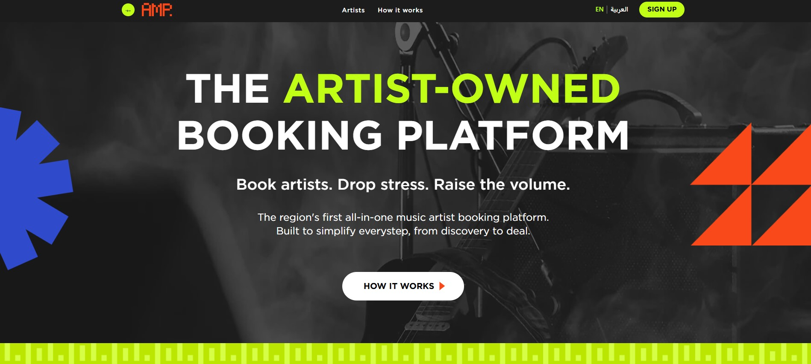

# Artist Platform

A platform where artists publish concerts, manage their profiles, and visitors browse events. Built with React + TypeScript and animated with Framer Motion. Supports LTR and RTL language directions with a toggle.

**Demo**: [Open demo][live-demo]



## Technologies Used
- [React](https://react.dev/)
- [TypeScript](https://www.typescriptlang.org/)
- [Framer Motion](https://www.framer.com/motion/)

### Features

Public artist listing and per-artist detail pages
Smooth page transitions and animated modals with framer-motion
RTL/LTR toggle, persisted in localStorage and applied to <html dir="rtl"> 
Responsive layout with CSS modules

### Getting Started

1. **Clone the repository:**

   ```bash
   git clone https://github.com/AslanovRustam/artist-platform

   cd artist-platform

   npm i

   npm run dev
   ```

   Open http://localhost:3000 in your browser to see the result.

   [live-demo]: https://artist-platform-nine.vercel.app/